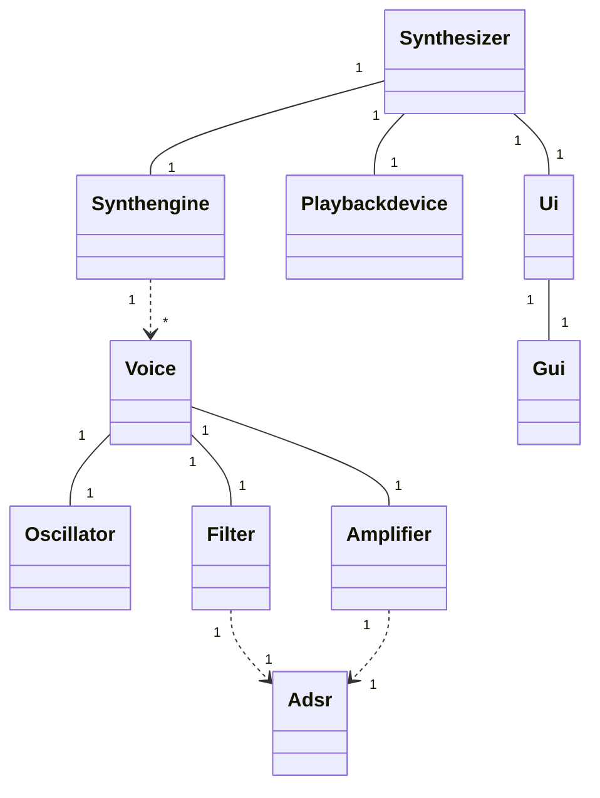
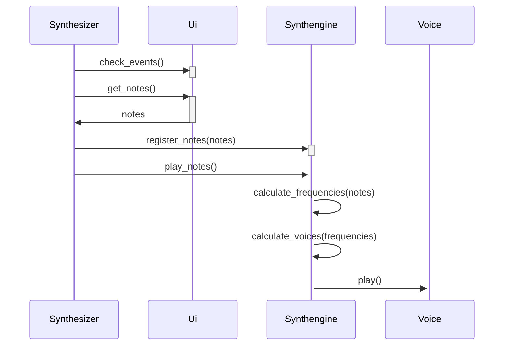

Luokkakaavio:

```mermaid
classDiagram
    class Synthesizer
    class Synthengine
    class Playbackdevice
    class Voice
    class Oscillator
    class Amplifier
    class Filter
    class Adsr
    class Ui
    class Gui

    Synthesizer "1" -- "1" Synthengine
    Synthesizer "1" -- "1" Playbackdevice
    Synthesizer "1" -- "1" Ui
    Ui "1" -- "1" Gui

    Synthengine "1" ..> "*" Voice
    Voice "1" -- "1" Oscillator
    Voice "1" -- "1" Filter
    Voice "1" -- "1" Amplifier
    Filter "1" ..> "1"  Adsr
    Amplifier "1" ..> "1" Adsr
```

Sekvenssikaavio prosessista, jossa käyttäjä painaa näppäintä ja kaiuttimista kuuluu ääni.

```mermaid
sequenceDiagram
    Synthesizer ->>+ Ui: check_events()
    deactivate Ui
    Synthesizer ->>+ Ui: get_notes()
    Ui ->>- Synthesizer: notes
    Synthesizer ->>+ Synthengine: register_notes(notes)
    deactivate Synthengine
    Synthesizer ->>+ Synthengine: play_notes()
    Synthengine ->> Synthengine: calculate_frequencies(notes)
    Synthengine ->> Synthengine: calculate_voices(frequencies)
    Synthengine ->>+ Voice: play()
    
```

