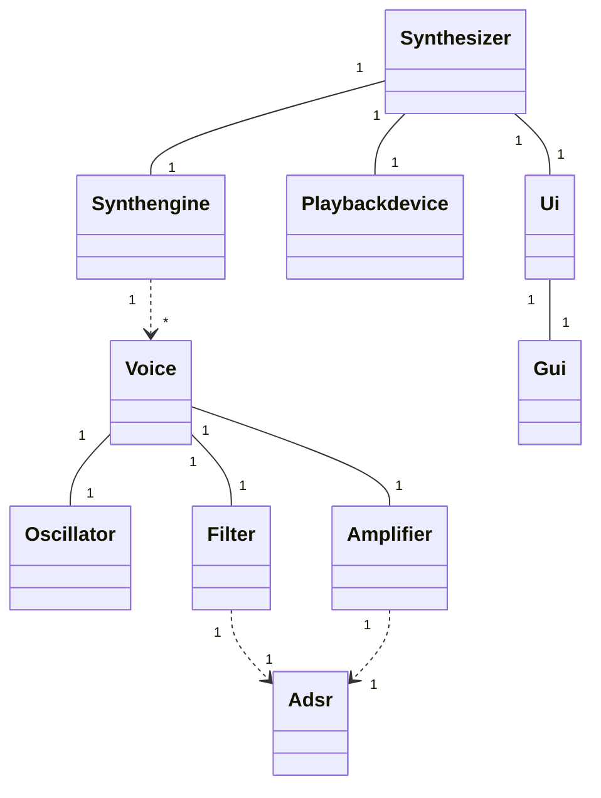
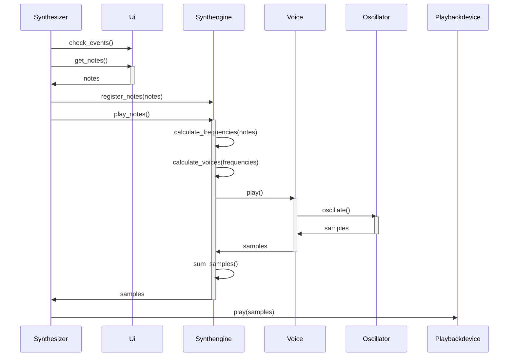

# Arkkitehtuurikuvaus

## Rakenne
Ohjelma koostuu kahdesta pakkauksesta. Pakkaus "synth" vastaa sovelluslogiikasta ja pakkaus "ui" vastaa käyttöliittymästä. Sovelluslogiikan puolelle lasketaan kaikki soitettavia nuotteja koskevan informaation vastaanottamisesta siihen, että kaiuttimista kuuluu soitto. Ui taas vastaa siitä, että se muuntaa jonkin syöteinstrumentin, tällä hetkellä tietokoneen näppäimistön, informaation nuoteiksi jotka voi lähettää sovelluslogiikalle soitettaviksi. Ui vastaa myös graafisen käyttöliittymän piirtämiestä ja tämän kautta määriteltävien soittimen asetusten seuraamisesta ja näitä koskevan tiedon välittämisestä sovelluslogiikalle.

## Käyttöliittymä
Ohjelman käyttöliittymä jakautuu kahteen osaan: näppäimistöön jolla soitinta soitetaan, ja graafiseen käyttöliittymään, jolla äänen asetuksia muokataan. Luokka Gui vastaa graafisen käyttöliittymän piirtämisestä ja lukemisesta ja luokka Keyboardinput vastaa näppäimistön lukemisesta. Luokka Ui vastaa näiden kahden hallitsemisesta ja tiedon välittämisestä sovelluslogiikan puolelle.

## Sovelluslogiikka
Luokka Synthesizer vastaa ohjelman pääloopin pyörittämisestä, kellon pitämisestä ja tapahtumien ajoittamisesta oikein. Se hakee käyttöliittymältä tietoa käyttäjän toimista, ja käskyttää Synthengine-luokkaa reagoimaan näihin toimiin asianmukaisesti. Synthengine saa tiedon käyttäjän soittamista nuoteista ja asettamista asetuksista ja pitää huolen, että jokaista soivaa nuottia kohden on olemassa Voice-olio oikeilla asetuksilla. Voice-olio tuottaa yhtä säveltä vastaavan äänen, ensin Oscillator-luokalla luoden yksinkertaisen aaltomuodon ja sitten Filter-luokan oliolla tätä aaltomuotoa muovaten. Kun jokaista säveltä vastaava lista äänidataa on luotu, summaa Synthengine-luokka ne yhteen, ja palauttaa Synthesizer-luokalle, joka lähettää summatut sävelet Playback-luokalle. Playback-luokka vastaa äänen soittamisesta laitteen äänentoistosta.

## Luokkakaavio

Alla on visuaalisesti esitettynä aiemmin kuvailtu kokonaisuus.

Luokkakaavio:

Sekvenssikaavio prosessista, jossa käyttäjä painaa näppäintä ja kaiuttimista kuuluu ääni:

