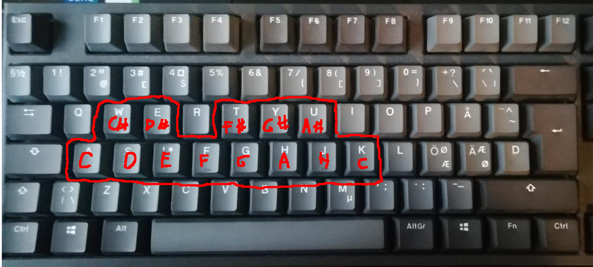

# Käyttöohje

## Soittaminen
Voit soittaa syntetisaattoria tietokoneesi näppäimistöllä. Seuraavassa kuvassa on rajattuna ne näppäimet, joilla voit soittaa. Käytössäsi on yksi oktaavi ja seuraavan oktaavin ensimmäinen sävel, jonka valkoisia koskettimia vastaa näppäinrivi A:sta K:hon ja mustia näppäimiä rivi W:stä U:hun. Kuvaan on piirretty näppäimien päälle, mitä säveltä ne vastaavat.

## Asetukset
Graafisella käyttöliittymällä voit muokata sitä, miltä soittimen ääni kuulostaa. Asetukset ovat otsikoituja.

- Oscillator select
    - Voit valita alla olevilla napeilla sahalaita-aallon (Saw) ja kantti-aallon (square) välillä. Nimet tulevat siitä, miltä aaltomuodot näyttävät visuaalisesti. Punainen ¤-merkki nappulan yllä näyttää kumpi on valittuna. Kokeile miltä aallot kuulostavat!
- Volume
    - Voit säätää liukusäätimellä sovelluksen äänenvoimakkuutta.

- Polyphony
    - Voit valita onko soitin yksiääninen (Mono) vai moniääninen (Poly). Jos valitset asetukseksi "Mono", vain korkein painamasi sävel kuuluu. Jos taas valitset "Poly", kuuluvat kaikki painamasi sävelet.

- Filter cutoff
    - Tällä liukusäätimellä saat valittua filtterin "cutoff-taajuuden". Se tarkoittaa sitä taajuutta, jonka ylä- tai alapuoliset taajuudet filtteri leikkaa pois äänestä. Tällä hetkellä filtteri leikkaa pois nimenomaan tätä rajaa korkeammat taajuudet, mutta ohjelmaan on tulossa nappi tämän vaihtamiselle. Tällä hetkellä soittimen äänessä kuuluu eräänlaista "rätinää", joka erottuu herkemmin jos leikkaa pois muut korkeat taajuudet. Tämä on jokin ongelma luultavasti pygamen audiokirjaston kanssa, joka toivottavasti, mutta ei välttämättä, saadaan korjattua kurssin aikana.

## Mahdollisista ongelmista

### Pätkimisestä
Jos soittimen ääni pätkii merkittävästi, ohjelman uudelleenkäynnistäminen auttaa asiaan. Ohjelman voi sulkea painamalla ESC, tai sulkemalla pygame-ikkunan ruksista.

### Näppäimistöstä
Joillakin huonolaatuisemmilla näppäimistöillä, kuten fuksiläppärin näppäimistöllä, soitin ei pysty rekisteröimään hyvin montaa painallusta samalla kertaa. Tämä lienee näiden näppäimistöjen hardware-vika, sillä toisilla näppäimistöillä taas pystyy soittamaan vaikka jokaista oktaavin säveltä kerralla ongelmitta.

### Hiiren käytöstä
Saatat huomata, että jos soitat soitinta samalla, kun koitat säätää asetuksia hiirellä, hiiri ei liikukaan. Havaintojeni mukaan näin käy vain läppärin touchpadilla, ja varsinaisella erillisellä tietokonehiirellä ongelmia ei ole. 