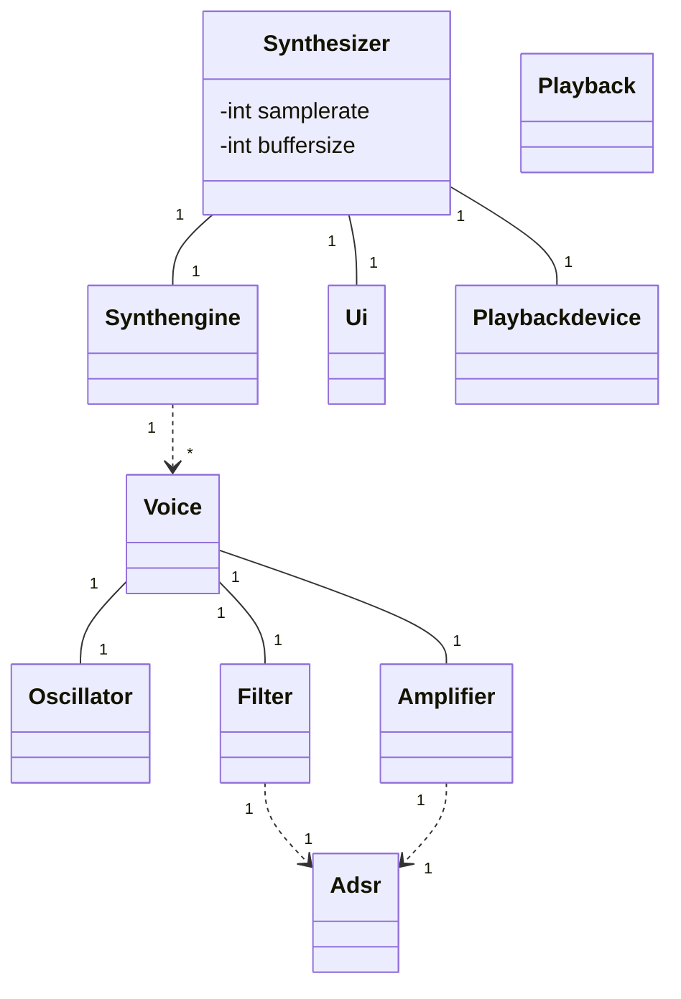

Luokkakaavio:

```mermaid
classDiagram
    class Synthesizer{
        -int samplerate
	-int buffersize
    }
    class Synthengine
    class Playback
    class Voice
    class Oscillator
    class Amplifier
    class Filter
    class Adsr
    class Ui

    Synthesizer "1" -- "1" Synthengine
    Synthesizer "1" -- "1" Playbackdevice
    Synthesizer "1" -- "1" Ui

    Synthengine "1" ..> "*" Voice
    Voice "1" -- "1" Oscillator
    Voice "1" -- "1" Filter
    Voice "1" -- "1" Amplifier
    Filter "1" ..> "1"  Adsr
    Amplifier "1" ..> "1" Adsr
```
