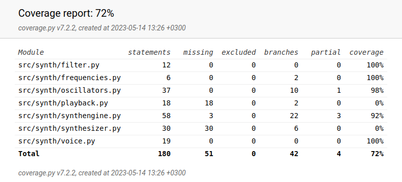

# Testausdokumentti
Ohjelman toimintaa on testattu automaattisten yksikkö- ja integraatiotestien avulla, sekä manuaalisesti.

## Yksikkö- ja integraatiotestaus
Ohjelman parhaiten automaattisesta testauksesta hyötyville luokille, Synthengine, Voice ja Oscillator on kirjoitettu vastaavat testiluokat TestSynthengine, TestVoice, ja TestOscillator. Nämä testaavat sekä luokkien yksittäisiä metodeja, että jonkin verran luokkien yhteistä toimintaa. Luokalle Synthesizer ei ole kirjoitettu testejä, sillä luokassa ei juuri ole haarautuvuutta, ja metodeitakin on hyvin vähän. Lisäksi se haarautuvuus, mitä luokan sisällä tapahtuu, perustuu reaaliaikaisiin tapahtumiin, joiden toimintaa mielekkäästi mallintavia testejä en keksinyt. Luokkaa Playback koskee sama asia, sen toiminta on reaaliaikaista ja sen sisällä ei tapahdu juuri haarautuvuutta. Luokan ainoa tehtävä on soittaa sille lähetetyt äänisamplet Pygamen äänikirjaston kautta laitteen kaiuttimista. Luokat Frequencies ja Filter ovat niin yksinkertaisia yhden tehtävän luokkia, että ajankäytöllisistä syistä priorisoin testien kirjoittamisen kohdalla muita luokkia.

Alla on kuva ohjelman, poislukien käyttöliittymä, testikattavuusraportin etusivusta.

## Järjestelmätestaus

Sovellusta on testattu käyttöohjeen mukaisella tavalla. Ohjelmassa ei ole ajamisajan ulkopuolella säilyviä tietokantoja tai muita vastaavia tiedostoja, joiden kanssa voisi tulla ongelmia. Ohjelma toimii tämän hetken tiedon valossa vain Linux-käyttöjärjestelmillä. Mac-tietokoneiden osalta asiaa ei olla voitu varmistaa. Kaikki määrittelydokumentissa mainitut ominaisuudet toimivat.

## Sovellukseen jääneet viat

Suurin vika on joillain käynnistyskerroilla tapahtuva äänen pätkiminen. Kokeilin kehittäessä kaikkia pythonin audiokirjastoja joita löysin, ja yksikään ei toiminut vähemmällä pätkimisellä. Reaaliaikaisen audiosovelluksen kehittämisestä pythonilla oli avoimesti saatavilla hyvin vähän materiaalia. Toinen, saman kaltainen vika on pieni, korkea rätinä joka paljastuu filtterin leikkauspisteen ollessa alhaalla. 